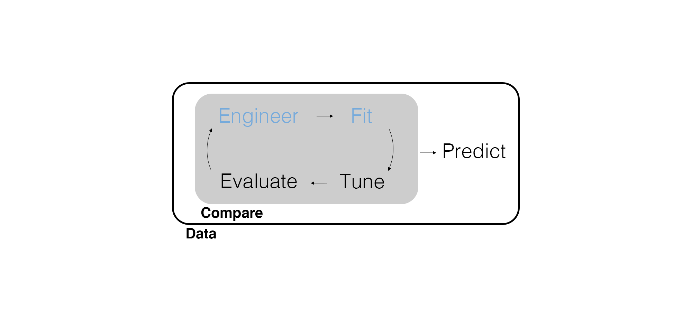
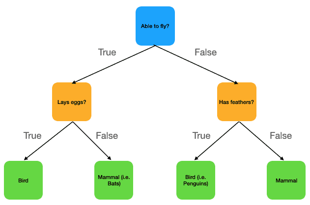
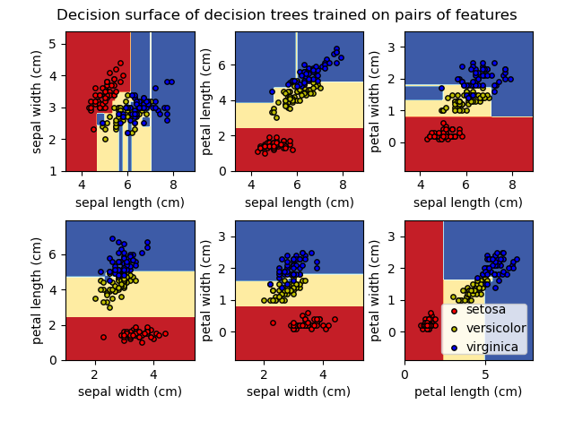
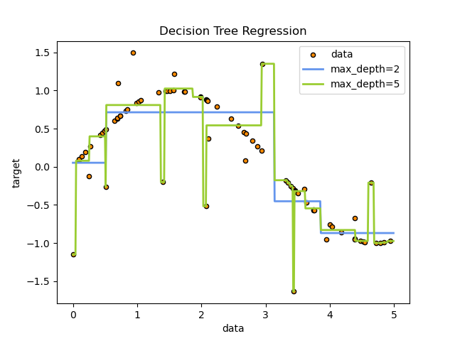

## Marketing Analytics Process

<center>
{width=900px}
</center>

## Predictive Modeling Workflow

<center>
{width=900px}
</center>

---

{width=500px}

## Supervised Learning and Prediction

We've already spent time with *supervised learning*, a model with an outcome variable. Specifically, we dealt with *regression* and *classification*.

We used supervised learning for *inference* (i.e., to understand the underlying data generating process), but now we care about *prediction*. So instead of letting our theories about the data generating process drive our selection of variables and worrying about whether our coefficient estimates are accurate, we'll need to run a *lot* of models and find which one is best for prediction.

## Import Data

Let's import and work with some new data.

```{r message=FALSE}
# Load packages.
library(tidyverse)
library(tidymodels)

# Set a simulation seed.
set.seed(42)
```

---

In this unit, we'll be examining survey data from iRobot (Roomba).

```{r message=FALSE}
roomba_survey <- read_csv(here::here("Data", "roomba_survey.csv"))

roomba_survey
```

---

```{r}
# Answers to S1? This is Q1 in the survey dictionary, i.e., the first screening question.
roomba_survey |> 
  count(S1)
```

## Outcome Variable

Going forward, we will perform feature engineering on our **outcome** variable first. In other words, we pre-process our outcome variable first, then split and pre-process our training and testing data.

```{r}
# Wrangle S1 into segment.
roomba_survey <- roomba_survey |> 
  rename(segment = S1) |> 
  mutate(
    # easier way to do multiple if-else statements!
    segment = case_when(
      segment == 1 ~ "own",
      segment == 3 ~ "shopping",
      segment == 4 ~ "considering"
    ),
    segment = factor(segment)
  )
```

---

<center>
{width=900px}
</center>

## Data Splitting by Strata

Once again, one of the first things we need to do is split the data. To be sure that we don't end up with testing data that doesn't include one of the categories in our outcome variable, use the `strata` argument.

```{r}
# Split data based on segment.
roomba_split <- initial_split(roomba_survey, prop = 0.75, strata = segment)
```

How could you check and see that this worked? (Hint: when using the `strata` argument, the splitting proportion is applied to each stratum separately).

## Decision Trees

We might be tempted to use a logistic regression since this is a classification model, but why wouldn't it work for this outcome?

Let's use a **decision tree**.

- Instead of fitting a line, split the data based on a decision rule using one of the predictors.
- Keep adding decision rules based on more predictors to split the data further.
- Use the resulting regions to classify (or minimize the residual sum of squares if its regression).

Clear as mud?

---

<center>

{width=700px}

<center>

---

<center>

{width=700px}

<center>

---

<center>

{width=700px}

<center>

---

Set the model, engine, and *mode* (since a decision tree can do regression or classification).

```{r}
# Set the model, engine, and mode.
roomba_model <- decision_tree() |> 
  set_engine(engine = "rpart") |> 
  set_mode("classification")
```

---

Without `fit()`, the set up here is a list of instructions. Where have we seen this before?

```{r}
roomba_model
```

## Workflows

A **workflow** is a tidymodels object that combines the instructions of a recipe and a model.

```{r}
# Create a workflow.
roomba_wf_01 <- workflow() |> 
  add_formula(
    segment ~ CleaningAttitudes_1 + CleaningAttitudes_2 + CleaningAttitudes_3 + 
      CleaningAttitudes_4 + CleaningAttitudes_5 + CleaningAttitudes_6 + 
      CleaningAttitudes_7 + CleaningAttitudes_8 + CleaningAttitudes_9 + 
      CleaningAttitudes_10 + CleaningAttitudes_11
  ) |> 
  add_model(roomba_model)
```

---

```{r}
roomba_wf_01
```

## Fit a Workflow

We can fit the workflow itself since it includes the formula and model instructions.

```{r}
# Fit a workflow.
wf_fit_01 <- fit(roomba_wf_01, data = training(roomba_split))

wf_fit_01
```

## Evaluate Predictive Fit

Similarly, we can evaluate predictive fit using the fitted workflow. For classification, there are a lot of possible measures of predictive fit, but accuracy is a natural one to use.

```{r}
# Compute model accuracy.
wf_fit_01 |> 
  predict(new_data = testing(roomba_split)) |>
  bind_cols(testing(roomba_split)) |>
  accuracy(truth = segment, estimate = .pred_class)
```

---

We can also compute a confusion matrix.

```{r}
# Compute a confusion matrix.
wf_fit_01 |>
  predict(new_data = testing(roomba_split)) |>
  bind_cols(testing(roomba_split)) |>
  conf_mat(truth = segment, estimate = .pred_class)
```

## Feature Engineering

We can certainly do better. What if we included some demographic predictors instead? We'll still want to dummy code them.

```{r}
# Build a recipe.
roomba_recipe <- training(roomba_split) |>
  recipe(
    segment ~ D1Gender + D2HomeType + D3Neighborhood + D4MaritalStatus
  ) |>
  step_dummy(all_nominal(), -all_outcomes())
```

Note that we haven't used `prep()` -- that's part of executing the workflow now.

## Update, Fit, and Evaluate

We didn't have a `recipe()` before, so we had to use `add_formula()`. Let's get rid of it and update our workflow with our new recipe.

```{r}
# Update the workflow.
roomba_wf_02 <- roomba_wf_01 |> 
  remove_formula() |>
  add_recipe(roomba_recipe)

roomba_wf_02
```

---

By fitting a workflow that includes a recipe, `prep()`, `bake()`, and `fit()` are all executed in one step.

```{r}
# Fit a second workflow.
wf_fit_02 <- fit(roomba_wf_02, data = training(roomba_split))

wf_fit_02
```

---

By predicting using a fitted workflow, it does `bake()` and `predict()` in one step.

```{r}
# Compute model accuracy.
wf_fit_02 |> 
  predict(new_data = testing(roomba_split)) |>
  bind_cols(testing(roomba_split)) |>
  accuracy(truth = segment, estimate = .pred_class)
```

---

```{r}
# Compute a confusion matrix.
wf_fit_02 |>
  predict(new_data = testing(roomba_split)) |>
  bind_cols(testing(roomba_split)) |>
  conf_mat(truth = segment, estimate = .pred_class)
```

## Predict using Cleaning Attitudes and Demographics

```{r}
# Build a new recipe.
roomba_recipe_full <- training(roomba_split) |>
  recipe(
    segment ~ D1Gender + D2HomeType + D3Neighborhood + D4MaritalStatus +
      CleaningAttitudes_1 + CleaningAttitudes_2 + CleaningAttitudes_3 + 
      CleaningAttitudes_4 + CleaningAttitudes_5 + CleaningAttitudes_6 + 
      CleaningAttitudes_7 + CleaningAttitudes_8 + CleaningAttitudes_9 + 
      CleaningAttitudes_10 + CleaningAttitudes_11
  ) |>
  step_dummy(all_nominal(), -all_outcomes())
```

## Update the Workflow Again

Notice we are updating the recipe this time.

```{r}
# Update the workflow.
roomba_wf_03 <- roomba_wf_02 |> 
  remove_recipe() |>
  add_recipe(roomba_recipe_full)

roomba_wf_03
```

## Fit the Workflow

```{r}
# Fit the full workflow.
wf_fit_03 <- fit(roomba_wf_03, data = training(roomba_split))

wf_fit_03
```

## Evaluate Predictions from the Full Model

```{r}
# Compute model accuracy.
wf_fit_03 |> 
  predict(new_data = testing(roomba_split)) |>
  bind_cols(testing(roomba_split)) |>
  accuracy(truth = segment, estimate = .pred_class)
```

## Confusion Matrix for the Full Model

```{r}
# Compute a confusion matrix.
wf_fit_03 |>
  predict(new_data = testing(roomba_split)) |>
  bind_cols(testing(roomba_split)) |>
  conf_mat(truth = segment, estimate = .pred_class)
```

## Notes on Growing (Training/Fitting) a Decision Tree

Workflows help with the fact that we're iterating on a lot of models as we try different predictors and changes to feature engineering. But we haven't said anything about *hyperparameters*.

- `tree_depth` maximum depth of the tree (default is 30)
- `min_n` minimum number of data points in a node to be split (default is 20)

---

```{r}
# Specify the model, engine, and mode.
roomba_model <- decision_tree(tree_depth = 2) |> 
  set_engine(engine = "rpart") |> 
  set_mode("classification")

roomba_model
```

---

```{r}
# Update the workflow.
roomba_wf_03 <- roomba_wf_03 |> 
  update_model(roomba_model)

roomba_wf_03
```

---

```{r}
# Fit the workflow.
wf_fit_03 <- fit(roomba_wf_03, data = training(roomba_split))

wf_fit_03
```

---

```{r}
# Compute model accuracy.
wf_fit_03 |> 
  predict(new_data = testing(roomba_split)) |>
  bind_cols(testing(roomba_split)) |>
  accuracy(truth = segment, estimate = .pred_class)
```

---

```{r}
# Compute a confusion matrix.
wf_fit_03 |>
  predict(new_data = testing(roomba_split)) |>
  bind_cols(testing(roomba_split)) |>
  conf_mat(truth = segment, estimate = .pred_class)
```

## Wrapping Up

*Summary*

- Demonstrated splitting data by strata.
- Discussed decision trees.
- Walked through building, using, and updating workflows.
- Tried a *little* hyperparameter tuning.

*Next Time*

- Why have one decision tree when you can have a forest?

*Supplementary Material*

- *Tidy Modeling with R* Chapter 7

*Artwork by @allison_horst*

## Exercise 16

1. Use `case_when()` to combine the `own` and `shopping` segments into a single category.
2. Use workflows to combine the cleaning attitudes and demographics we've used in class and fit both a logistic regression and a decision tree. Which one has better predictive fit?
3. Try and tune the decision tree hyperparameters to improve its predictive fit.
4. Render the Quarto document into Word and upload to Canvas.

